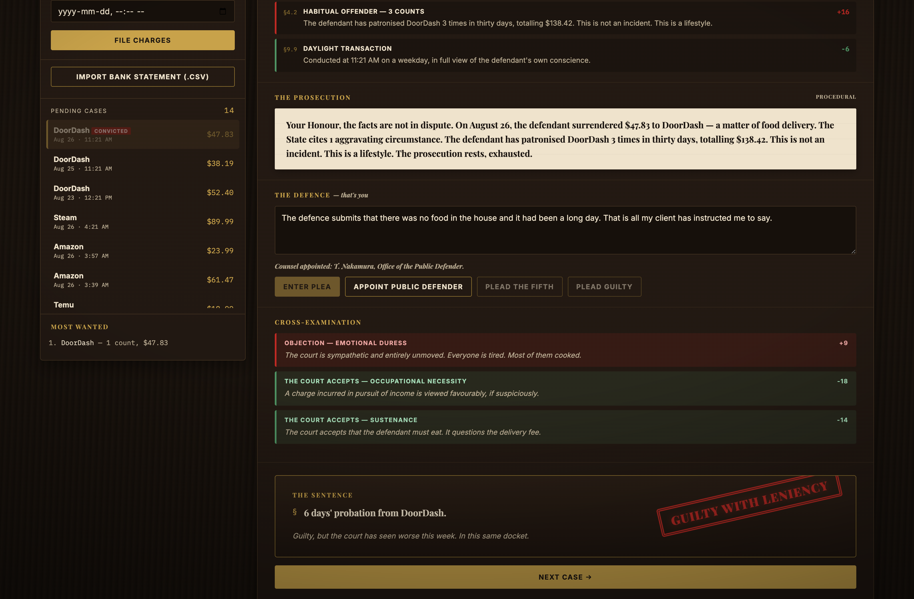
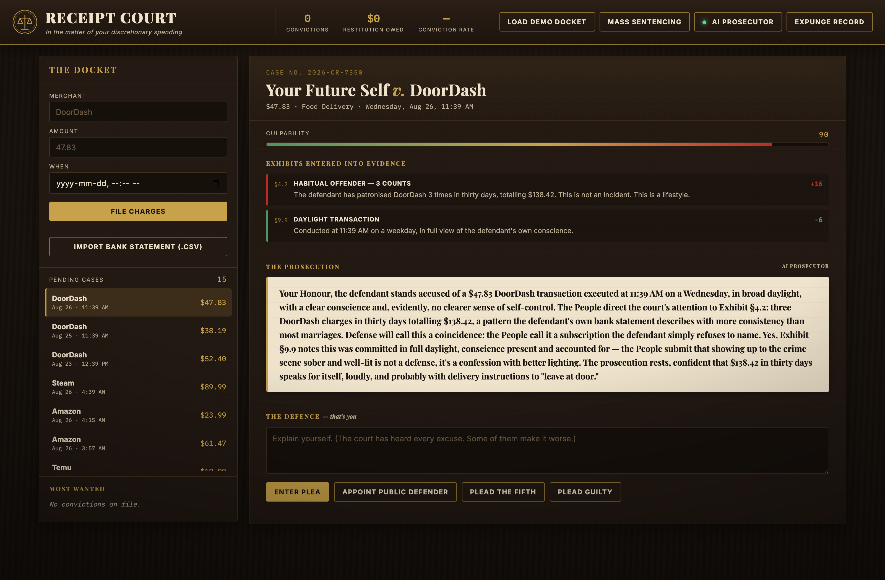
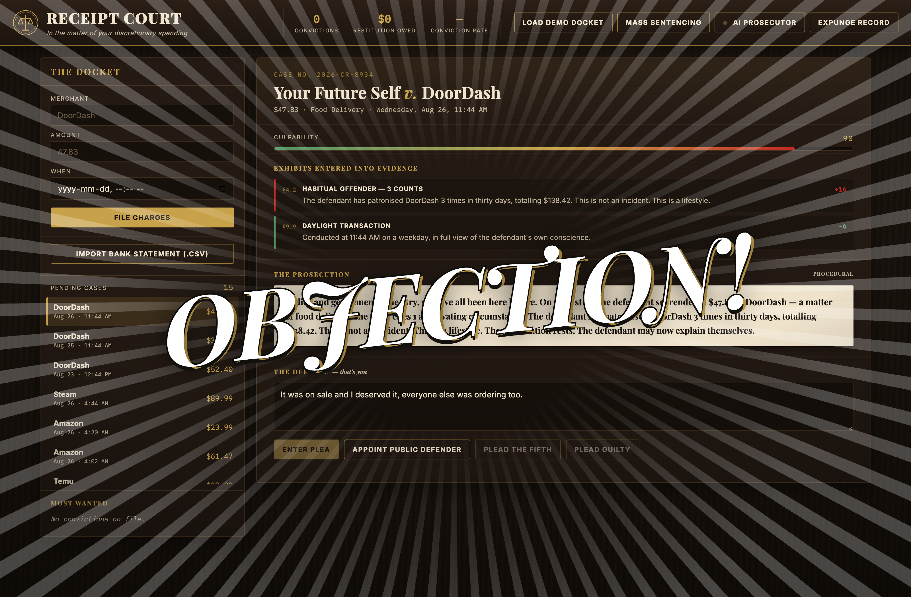
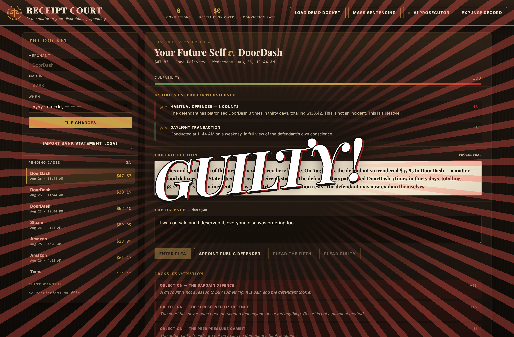

# Receipt Court

An expense tracker rebuilt as a criminal court. Every purchase is a defendant. You have the right to an attorney. You are the attorney.

Live: [https://liam-prod.github.io/receipt-court/?demo=1](https://liam-prod.github.io/receipt-court/?demo=1)

## The prompt

> Choose a boring, everyday application format and reinvent it with a dramatically more engaging visual design, UX, or functionality.

The boring format is the expense tracker / budgeting app. Those products show you a pie chart and you feel nothing. Receipt Court makes you *articulate a defence* for the purchase — that is the actual psychological intervention. Being cross-examined about a 2:41am DoorDash order changes behaviour. A bar chart does not.

The courtroom is the UX: file a charge, sit through an indictment, type a plea in your own words (or appoint counsel who will do it badly), take the cross, and watch a red stamp slam the verdict. The numbers are still there. They are now exhibits.

## Screenshots

The courtroom, mid-trial. The docket is on the left; the case is on the right.


Exhibits entered into evidence. The statutes have already made up their minds.


Counsel appointed. The plea is being typed badly, on purpose.



The stamp. The sentence. The gavel.


The defendant's criminal record, once the docket has been disposed of.


A live District Attorney, arguing from the same exhibits.



OBJECTION. The prosecution has heard this one.



The verdict slam. No image assets were harmed.



## How a case is tried

1. **File a charge.** Merchant, amount, and time. Or import a bank-statement CSV. Or load the demo docket.
2. **The culpability engine** scores the transaction 0–100 against the whole docket and enters exhibits into evidence.
3. **The prosecution** delivers an indictment assembled from those exhibits.
4. **You type a plea** in your own words. (You may also plead guilty, plead the Fifth, or appoint the public defender.)
5. **The plea is cross-examined.** Nine bad-defence regexes make things worse. Seven good ones help. Silence, shouting, and a bare guilty plea are handled separately. A bad excuse earns a full-screen **OBJECTION**.
6. **Verdict.** GUILTY, GUILTY WITH LENIENCY, NOT GUILTY, or CASE DISMISSED — a full-screen slam, a sentence, a red stamp, and a gavel bang synthesised in Web Audio. No image or audio assets. The court does not license stock wood.

You may waive the right to plead and request **mass sentencing**. The court will rule on the evidence alone and then show the criminal record.

## Office of the Public Defender

You have the right to an attorney. You are the attorney. You may, however, appoint one.

**Appoint Public Defender** names counsel from a seeded roster (the same charge always draws the same lawyer) and types a plea in real time, character by character. Then it enters the plea. The text is deliberately mediocre: category-specific excuses built from the patterns `js/prosecutor.js` is designed to demolish — on sale, deserved it, everyone else was ordering, long day, it will pay for itself. Appointing counsel usually makes things worse.

On a genuine necessity (category frivolity ≤ 12), counsel stumbles into the correct argument, mostly by accident, having read the file once in the lift.


## Splashes

Ace Attorney, applied to a debit. `js/splash.js` slams **OBJECTION** across the screen when the plea trips a bad-defence pattern, and **GUILTY** / **NOT GUILTY** / **DISMISSED** with the verdict. Procedural speed lines, a screen shake, a flash, and a synthesised brass sting (detuned sawtooth stack, G4 on acquittal, B♭3 on conviction). All generated. Nothing in the repo is an image or a sound file. `prefers-reduced-motion` skips the whole production.


## Judging walkthrough

Thirty seconds. No account, no key.

1. Open [https://liam-prod.github.io/receipt-court/?demo=1](https://liam-prod.github.io/receipt-court/?demo=1). (`?demo=1` seeds only an empty docket — **Expunge Record** first if a prior session is still on file.) The first DoorDash charge is already in the dock.
2. Read the exhibits. The statutes have already scored the case.
3. In the plea box, type exactly: `It was on sale and I deserved it, everyone else was ordering too. I'd had a long day.`
4. Hit **Enter Plea**. Four objections land — the bargain defence, “I deserved it”, peer pressure, and emotional duress — then the stamp. Watch for the OBJECTION slam on the way in.
5. Click **Mass Sentencing**, confirm the waiver, and scroll to **The Defendant's Criminal Record**: convictions by category, culpability across the docket.

Optional: **Appoint Public Defender** instead of typing, to watch counsel lose the case for you.

## Engineering

Vanilla ES modules, built with Vite. The courtroom runs entirely in the browser. A CSS keyframe slams the stamp; GSAP drops the sentence in, line by line, and drives the splashes. Chart.js draws the record. canvas-confetti fires only when the defendant is not convicted. Papa Parse reads the statement.

### `js/culpability.js` — twelve statutes

Each transaction is scored against the whole docket, not in isolation. Positive weight aggravates; negative weight mitigates. Base culpability is the category's presumed frivolity. Exhibits move it. The result is clamped 0–100.

Aggravating: commerce during the witching hour (00:00–05:00) and late-night weakness after 22:00; premature refreshment (bar or liquor before noon); grossly excessive sum versus a per-category reasonable-person baseline; habitual-offender recidivism at the same merchant within thirty days; a coordinated spree of three or more charges inside ninety minutes; same merchant, same day; charm pricing (`.99` / `.95` on amounts over $10); payday euphoria (the 1st–2nd or 15th–16th).

Mitigating: necessity of life, de minimis (≤ $8), first offence at this establishment, daylight weekday transaction.

A **mulberry32** PRNG, seeded from a hash of the case, keeps procedural text stable. The same charge always reads the same.

### `js/prosecutor.js` — the District Attorney

A procedural argument engine. It composes the indictment from the exhibits, then cross-examines the plea with **9 bad-defence** and **7 good-defence** regex patterns that actually move the score.

The court has heard "it was on sale" and "I deserved it." They make things worse. "It was for work" or "it broke" help. Silence is not golden. Shouting is contempt. A long, specific plea with no red flags earns a small benefit of the doubt. Pleading guilty is cooperation.

Verdict bands: ≥72 GUILTY, ≥48 GUILTY WITH LENIENCY, ≥26 NOT GUILTY, otherwise CASE DISMISSED. Sentences include restitution to savings, category prohibitions, and deleting the app.

### `js/defender.js` — the Office of the Public Defender

Seeded plea generator. Preamble, a category excuse (or a generic one), optional second excuse on charges over $60, a flourish. Names counsel. The UI types it; the engine does not.

### `js/splash.js` — theatrics

Full-screen callouts. GSAP timeline, CSS speed lines, Web Audio sting. No assets.

### `js/ai.js` — optional Cursor API tier

Working. The interesting part is not the prompt; it is how Cursor's agent API actually behaves. See **Optional AI prosecutor** below. Keys and the warm agent id live in `localStorage` only. They are never committed. Any failure leaves the procedural prosecutor on screen.

### `js/import.js` — bank-statement CSV

Sniffs columns across the three layouts banks actually ship: separate debit/credit columns, a signed amount column (negative = money out), or an unsigned debit-only export. Credits — refunds, paycheques — are dropped. The court prosecutes money leaving.

### `js/record.js` — Chart.js criminal record

Shown once at least one charge has been convicted. Doughnut of convictions by category; bar of culpability across every settled case. The most egregious offence is named.

### The gavel

Web Audio: a fast-decaying low sine with a pitch drop, plus a short burst of bandpassed noise. Wooden knock, no files.

## Run it locally

```bash
mise install
npm install
npm run dev
```

Node 22 via [mise](https://mise.jdx.dev). `npm run build` writes a static site to `docs/` for GitHub Pages.

## Optional AI prosecutor

The court is fully offline by default. You never need this. The procedural DA is already on screen before the live one is asked to stand.

Cursor's agent API provisions a **cloud VM per launch**. Cold start is about **87 seconds**. After that the agent sits at `IDLE`, and `POST /v0/agents/{id}/followup` returns immediately and reuses it — about **8 seconds** per subsequent question. So the court empanels **one** agent, pays the boot once, and puts every later case to the same counsel. The id is persisted (`receipt-court:agent-id`), so a reload keeps the warm agent instead of provisioning another VM.

Two further quirks of the API, which `js/ai.js` works around:

1. **`POST /v1/agents` creates the agent but never returns.** The connection hangs. The court fires the request, aborts it after four seconds, and identifies what it just made by diffing `GET /v1/agents` before and after.
2. **The surface is split across versions.** Creation and listing live under `/v1`. Status, followup, and conversation live under `/v0`.

Questions are queued: one agent means one conversation. `warmAgent()` starts the boot when credentials are saved, so the first indictment does not pay for it in front of the jury.

Cursor's API sends no CORS headers, and Chrome's Private Network Access blocks a public HTTPS page from calling localhost unless the private side opts in. `scripts/da-proxy.py` is a **stdlib-only** CORS shim (no pip): it forwards the path untouched, injects `Access-Control-Allow-Origin` and `Access-Control-Allow-Private-Network`, and upstreams to `https://api.cursor.com`.

```bash
export CURSOR_API_KEY=sk-...
python3 scripts/da-proxy.py
```

The proxy listens on `http://localhost:8788` (override with `DA_PROXY_PORT`). Then open **AI Prosecutor**:

- **Base URL** — `http://localhost:8788` (already the default)
- **API key** — `localStorage` only
- **Model** — default `gemini-3.7-flash`
- **Transport** — Cursor background agent (the path above) or OpenAI-compatible `/chat/completions`

Enable escalation. The live model argues from the same exhibits. On any failure the procedural prosecutor continues; the source line reads `PROCEDURAL (AI UNAVAILABLE)`. The core loop cannot break mid-trial.


