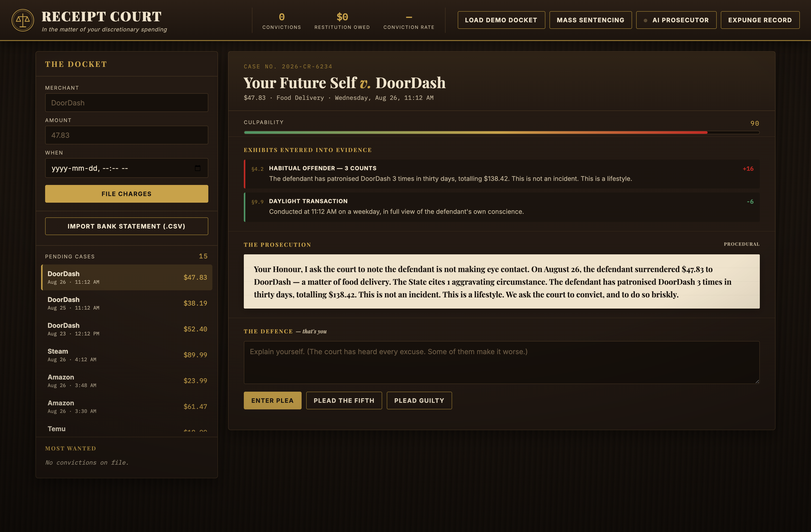
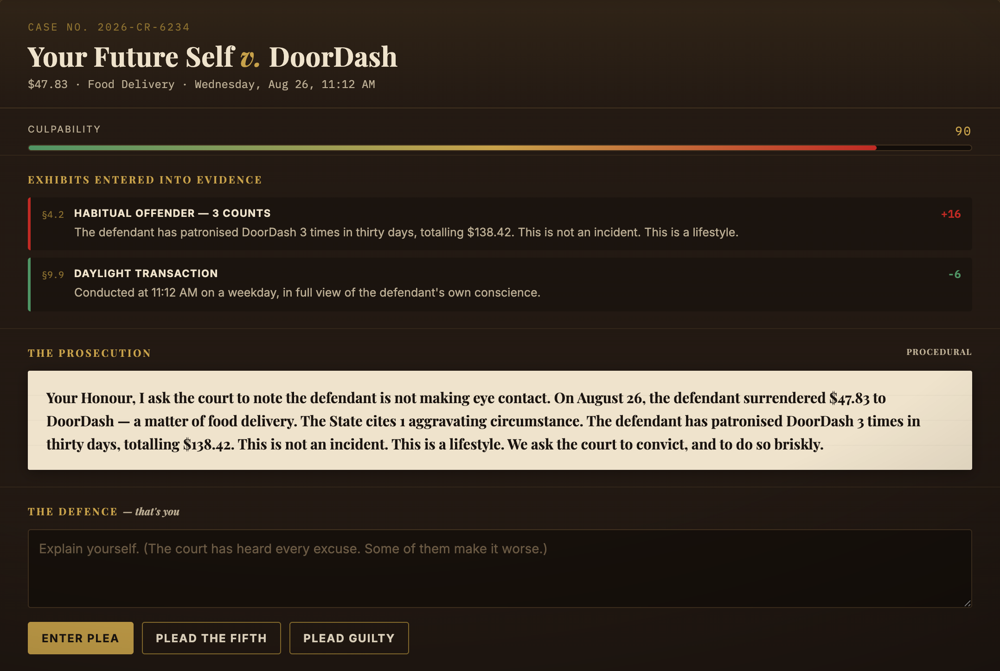
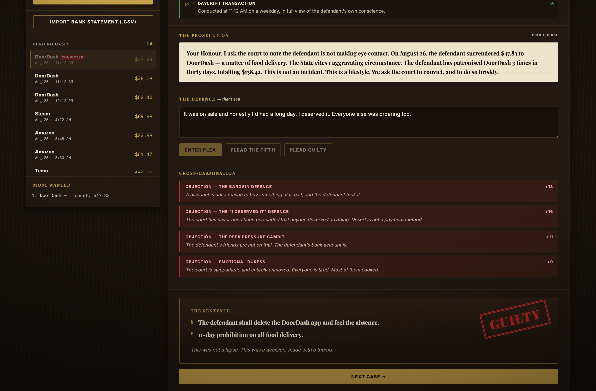
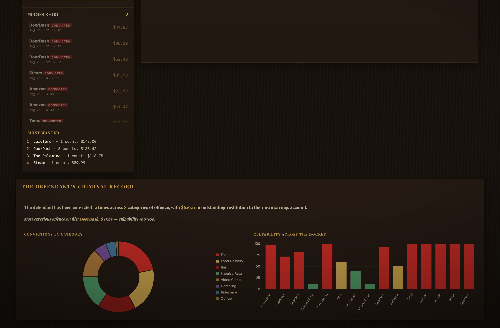

# Receipt Court

An expense tracker rebuilt as a criminal court. Every purchase is a defendant. You have the right to an attorney. You are the attorney.

Live: [https://liam-prod.github.io/receipt-court/?demo=1](https://liam-prod.github.io/receipt-court/?demo=1)

## The prompt

> Choose a boring, everyday application format and reinvent it with a dramatically more engaging visual design, UX, or functionality.

The boring format is the expense tracker / budgeting app. Those products show you a pie chart and you feel nothing. Receipt Court makes you *articulate a defence* for the purchase — that is the actual psychological intervention. Being cross-examined about a 2:41am DoorDash order changes behaviour. A bar chart does not.

The courtroom is the UX: file a charge, sit through an indictment, type a plea in your own words, take the cross, and watch a red stamp slam the verdict. The numbers are still there. They are now exhibits.

## Screenshots

The courtroom, mid-trial. The docket is on the left; the case is on the right.



Exhibits entered into evidence. The statutes have already made up their minds.



A plea that the court has heard before, dismantled in public.



The stamp. The sentence. The gavel.


The defendant's criminal record, once the docket has been disposed of.



## How a case is tried

1. **File a charge.** Merchant, amount, and time. Or import a bank-statement CSV. Or load the demo docket.
2. **The culpability engine** scores the transaction 0–100 against the whole docket and enters exhibits into evidence.
3. **The prosecution** delivers an indictment assembled from those exhibits.
4. **You type a plea** in your own words. (You may also plead guilty, or the Fifth. The court draws inferences.)
5. **The plea is cross-examined.** Nine bad-defence regexes make things worse. Seven good ones help. Silence, shouting, and a bare guilty plea are handled separately.
6. **Verdict.** GUILTY, GUILTY WITH LENIENCY, NOT GUILTY, or CASE DISMISSED — with a sentence, a red stamp slam, and a gavel bang synthesised in Web Audio. No audio assets. The court does not license stock wood.

You may waive the right to plead and request **mass sentencing**. The court will rule on the evidence alone and then show the criminal record.

## Judging walkthrough

Thirty seconds. No account, no key.

1. Open [https://liam-prod.github.io/receipt-court/?demo=1](https://liam-prod.github.io/receipt-court/?demo=1). (`?demo=1` seeds only an empty docket — **Expunge Record** first if a prior session is still on file.) The first DoorDash charge is already in the dock.
2. Read the exhibits. The statutes have already scored the case.
3. In the plea box, type exactly: `It was on sale and I deserved it, everyone else was ordering too. I'd had a long day.`
4. Hit **Enter Plea**. Four objections land — the bargain defence, “I deserved it”, peer pressure, and emotional duress — then the stamp.
5. Click **Mass Sentencing**, confirm the waiver, and scroll to **The Defendant's Criminal Record**: convictions by category, culpability across the docket.

## Engineering

Vanilla ES modules, built with Vite. The courtroom runs entirely in the browser. A CSS keyframe slams the stamp; GSAP drops the sentence in, line by line. Chart.js draws the record. canvas-confetti fires only when the defendant is not convicted. Papa Parse reads the statement.

### `js/culpability.js` — twelve statutes

Each transaction is scored against the whole docket, not in isolation. Positive weight aggravates; negative weight mitigates. Base culpability is the category's presumed frivolity. Exhibits move it. The result is clamped 0–100.

Aggravating: commerce during the witching hour (00:00–05:00) and late-night weakness after 22:00; premature refreshment (bar or liquor before noon); grossly excessive sum versus a per-category reasonable-person baseline; habitual-offender recidivism at the same merchant within thirty days; a coordinated spree of three or more charges inside ninety minutes; same merchant, same day; charm pricing (`.99` / `.95` on amounts over $10); payday euphoria (the 1st–2nd or 15th–16th).

Mitigating: necessity of life, de minimis (≤ $8), first offence at this establishment, daylight weekday transaction.

A **mulberry32** PRNG, seeded from a hash of the case, keeps procedural text stable. The same charge always reads the same.

### `js/prosecutor.js` — the District Attorney

A procedural argument engine. It composes the indictment from the exhibits, then cross-examines the plea with **9 bad-defence** and **7 good-defence** regex patterns that actually move the score.

The court has heard "it was on sale" and "I deserved it." They make things worse. "It was for work" or "it broke" help. Silence is not golden. Shouting is contempt. A long, specific plea with no red flags earns a small benefit of the doubt. Pleading guilty is cooperation.

Verdict bands: ≥72 GUILTY, ≥48 GUILTY WITH LENIENCY, ≥26 NOT GUILTY, otherwise CASE DISMISSED. Sentences include restitution to savings, category prohibitions, and deleting the app.

### `js/ai.js` — optional Cursor API tier

If credentials are supplied, the DA is escalated to a live model that argues from the same exhibits (indictment and cross-examination). Any failure falls back to the procedural prosecutor already on screen; the source line notes when the live DA is unavailable. The core loop cannot break mid-trial.

Keys live in `localStorage` only. They are never committed.

### `js/import.js` — bank-statement CSV

Sniffs columns across the three layouts banks actually ship: separate debit/credit columns, a signed amount column (negative = money out), or an unsigned debit-only export. Credits — refunds, paycheques — are dropped. The court prosecutes money leaving.

### `js/record.js` — Chart.js criminal record

Shown once at least one charge has been convicted. Doughnut of convictions by category; bar of culpability across every settled case. The most egregious offence is named.

### The gavel

Web Audio: a fast-decaying low sine with a pitch drop, plus a short burst of bandpassed noise. Wooden knock, no files.

## Run it locally

```bash
mise install
npm install
npm run dev
```

Node 22 via [mise](https://mise.jdx.dev). `npm run build` writes a static site to `docs/` for GitHub Pages.

## Optional AI prosecutor

The court is fully offline by default. You never need this.

To retain a live DA: open **AI Prosecutor**, supply a Cursor API base URL, key, and model (defaults: `https://api.cursor.com/v0`, `claude-4.5-sonnet`), test the connection, and enable escalation. Credentials stay in this browser and are sent only to the endpoint you configured. If the model is unavailable, the procedural prosecutor already on screen continues; the source line reads `PROCEDURAL (AI UNAVAILABLE)`.
